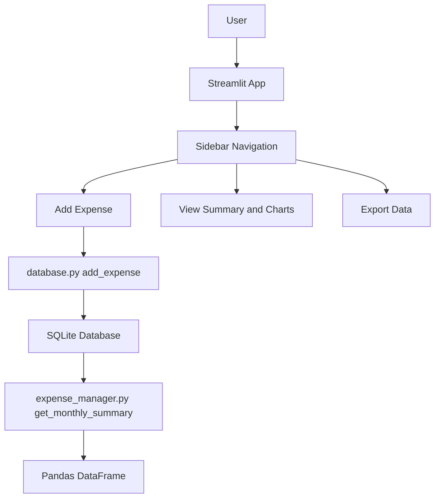

# Smart Expense Tracker 💰

A modern, user-friendly expense tracking web application built with Python, Streamlit, SQLite, Pandas, and Matplotlib.  
Track daily expenses, view monthly summaries, analyze spending with orange bar charts, and export data in a clean browser interface.

🔗 Live Demo: https://smart-expence-tracker.streamlit.app/

---

## 🏗️ Architecture Diagram

    DF --> CH[Charts]
    DF --> CSV[CSV Export]
