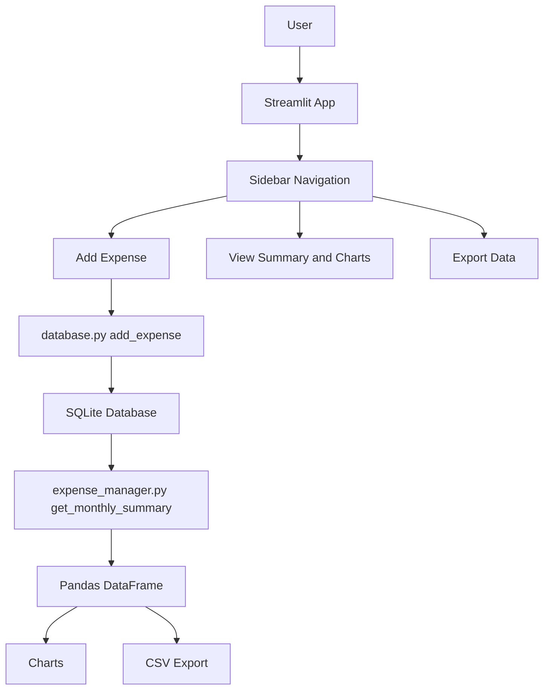

# Smart Expense Tracker 💰

A modern, user-friendly expense tracking web application built with Python, Streamlit, SQLite, Pandas, and Matplotlib.  
Track daily expenses, view monthly summaries, analyze spending with orange bar charts, and export data in a clean browser interface.

🔗 Live Demo: https://smart-expence-tracker.streamlit.app/

---

## 🏗️ Architecture Diagram

## ✨ Features

- ➕ Add expenses with date, category, amount, and description
- 📊 Monthly summary with category-wise breakdown
- 📈 Interactive orange bar chart showing spending by category
- 📥 Export all expenses to CSV
- 🗄️ Persistent storage using SQLite (no external database needed)
- Clean, responsive Streamlit interface with sidebar navigation
- Month/year selector for historical analysis

## 🛠️ Tech Stack

| Layer            | Technology             |
|------------------|------------------------|
| Frontend         | Streamlit              |
| Backend / Logic  | Python                 |
| Database         | SQLite                 |
| Data Processing  | Pandas                 |
| Visualization    | Matplotlib + Streamlit native charts |
| Styling          | Streamlit built-in + custom colors |

## 📂 Project Structure
smart-expense-tracker/
├── app.py               
├── database.py          
├── expense_manager.py   
├── visuals.py           
├── expenses.db          
├── requirements.txt
└── README.md
